As some of you might know, I’ve always had an interest in repairing old and obscure hardware. One of my contacts approached me and mentioned he wanted to get rid of the robot because it no longer charged. Of course, I told him I’d be very interested in taking a look at it. At the end it turned out to be a shorted reverse-protection diode on the board. I am happy I could fix this bot easily with a new 5-cent diode.

## Background

The Sanbot Elf is a Chinese humanoid robot from the company Qihan, launched in 2017. It features a 3D camera, HD camera, an Android tablet (which runs painfully slow due to a mediocre 2018 SoC — the Allwinner A83), animated eyes, a speech engine, LEDs, and motors throughout the body.

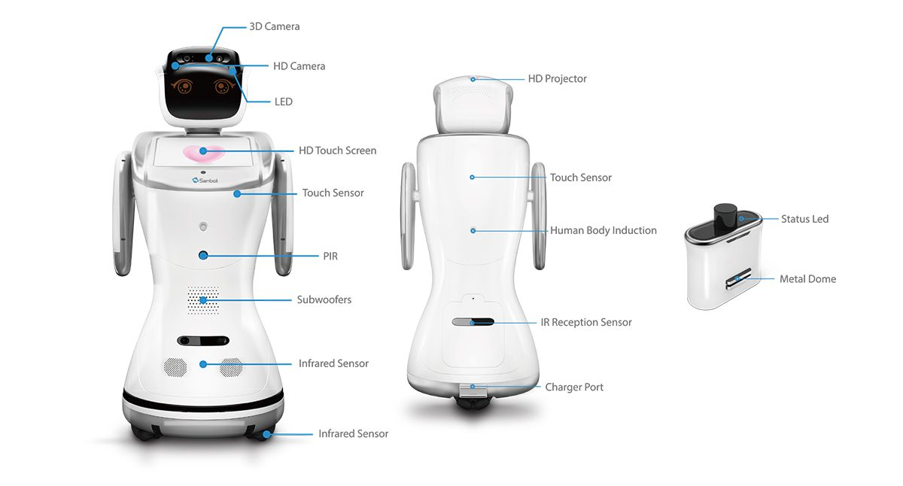

## Prior Work

Before getting my hands on the robot, I searched the internet for information about the hardware. It didn’t take long before I stumbled upon this great [reverse engineering project by Vidicon and Matthijsfh](https://github.com/Vidicon/sanbot_elf_hacking). The repository contains a reverse-engineered block diagram and newly written firmware for the main board and head board.

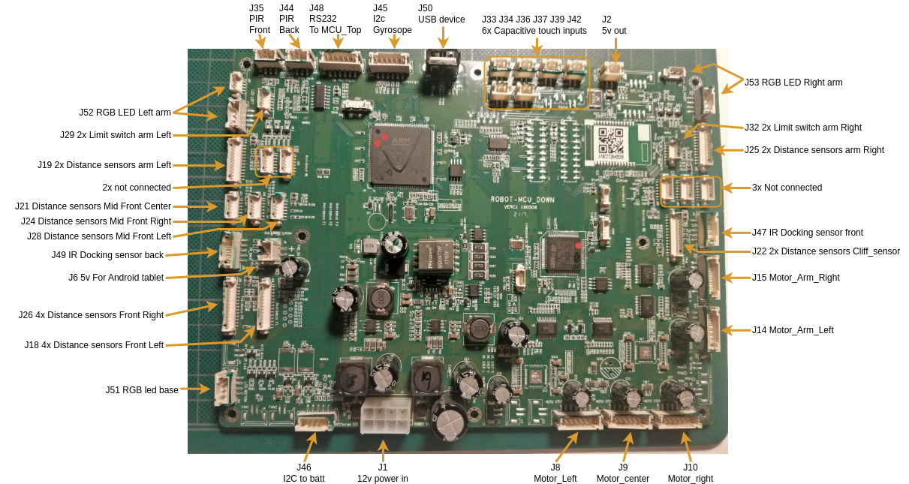

This gave me the first clue that the Sanbot likely contains a separate power board supplying the system with 12V. Since the robot is mobile and powered by a 12V system, it likely uses a 4S Li-ion battery pack. From the sanbot_elf_hacking repository, it becomes clear that the battery communicates its status over SMBus. That brought back memories of medical battery packs that use a similar system, often with a rather annoying undervoltage lockout mechanism. Once triggered, that lockout can permanently disable the battery. Luckily, the IC used in the BMS is a BQ3055, a 2–4 series Li-ion battery pack manager with an integrated fuel gauge, which does not appear to implement this UVLO protection.

While digging a bit deeper, I also found [this useful block diagram from Igor Lirussi’s thesis](https://amslaurea.unibo.it/id/eprint/19120/1/lirussi_igor_tesi.pdf), which provides a more complete overview of the entire system.

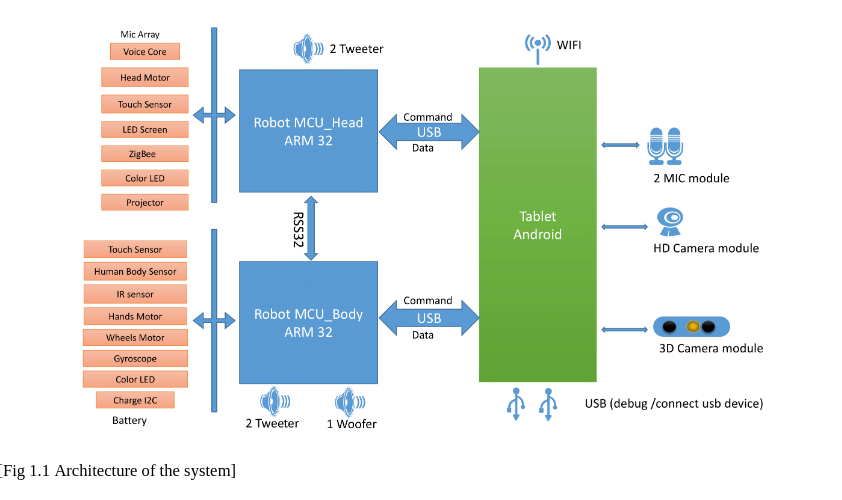

This block-diagram gives away that it does everything over USB with easy to debug protocols. It gave me hope that we might eventually be able to upcycle the robot by replacing the tablet with our own tablet or computer, running custom software that communicates with the rest of the system.

## Disassembling

The battery compartment at the back is secured with a single screw. After removing it, you can unscrew the full back cover. Afterwards you can try to wiggle/pull it off. It has locking tabs, so it might feel a bit uncomfortable trying to get it off.

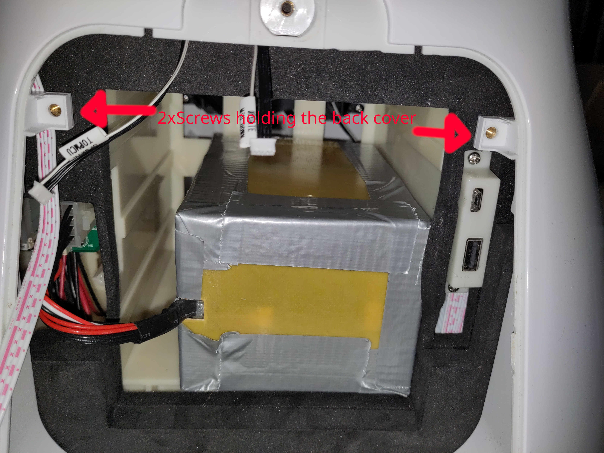

When it's off you will find two circuit boards at the back. The top one is the Mainboard and the other one is the power board.
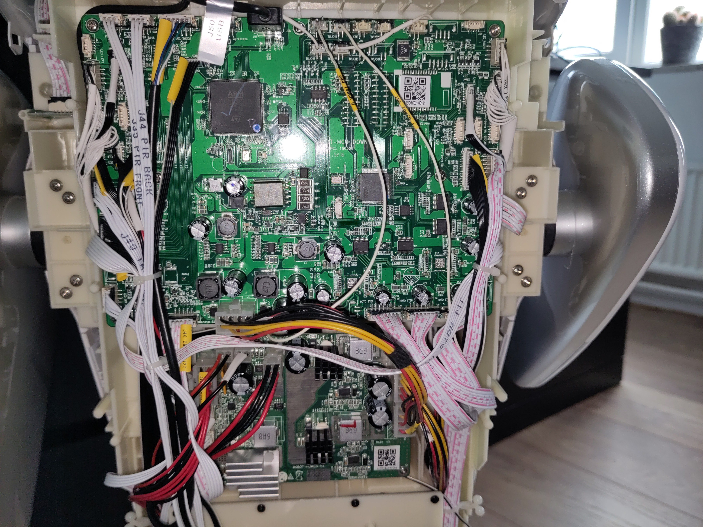

## Troubleshooting the battery

First thing that got my attention is the battery. First I checked the voltage, which seemed to be fine (@15.58V means ~40% SOC):
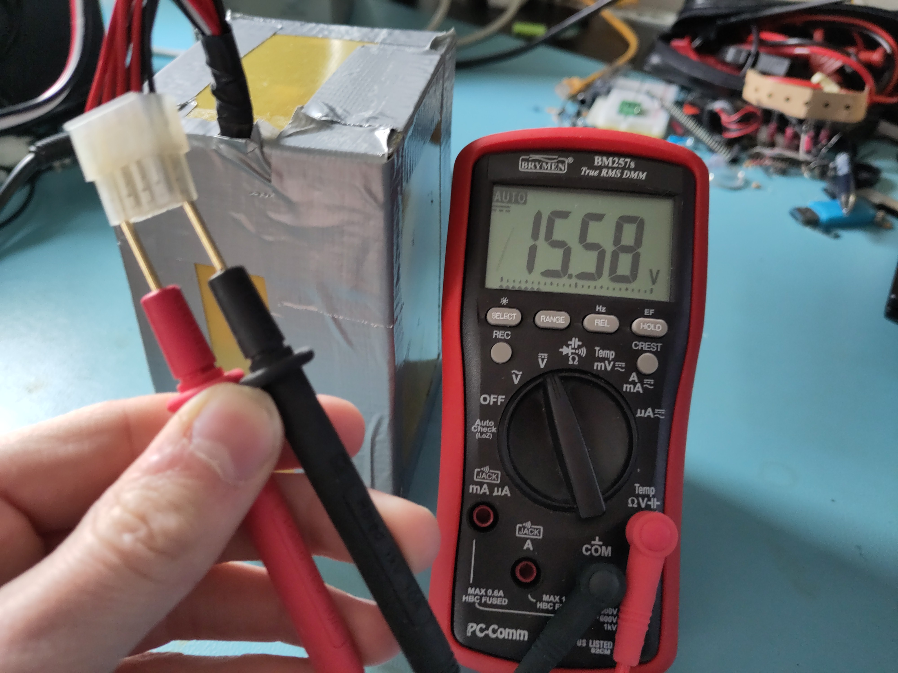

That meant that the BMS is allowing to discharge the battery. Good! Maybe it does not accept charging, as the battery might be unbalanced or any other fault event has occurred. So let's try to read it using I2C...

As we have found from earlier research, we know that it has a BQ3055 charge-ic. I really want to read it out using an Arduino library, as writing my own library would be time-consuming. So I could unfornately not find a direct software library for this ic, however it's [newer sibling the BQ40Z50 does have a library](https://github.com/sparkfun/SparkFun_BQ40Z50_Battery_Manager_Arduino_Library). When checking the datasheets and application notes, not much seems to have changed, even the addresses match. So this must work! Right?

Astalavista, I am in!

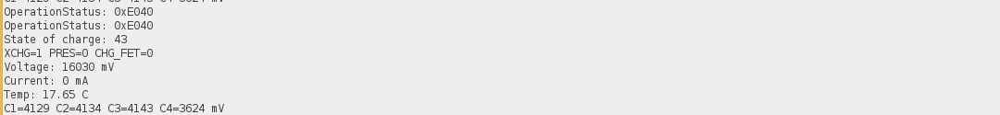

Using a cheap ESP32, I had laying around and a simple arduino sketch, I managed to read out the battery.

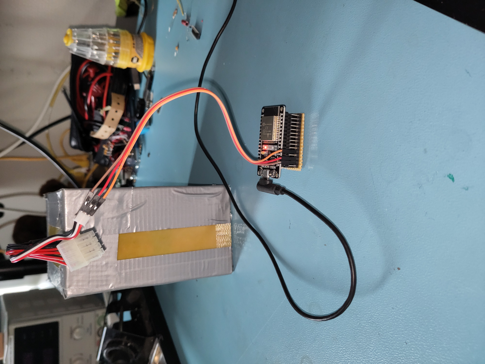

Link to the battery readout script:

[sanbot_battery_readout_script.ino](assets/sanbot_battery_readout_script.ino){:download}

From the serial monitor output it became clear that although the battery is not in a good state (cell imbalance of >0.5V). Such an imbalance is problematic, as it increases stress on the weaker cell and can accelerate degradation or, in worst cases, lead to unsafe operating conditions. Interestingly and somewhat concerning, it does try to charge, as the charging mosfets are not blocked.

This suggested that even if the battery were replaced, the issue might still lie within the Sanbot’s internal charger circuitry.

## Troubleshooting the power board

The power board is located underneath the mainboard and consists of a battery-charger ic (BQ2461X) and two synchronous 12V buck converters (LM25116).

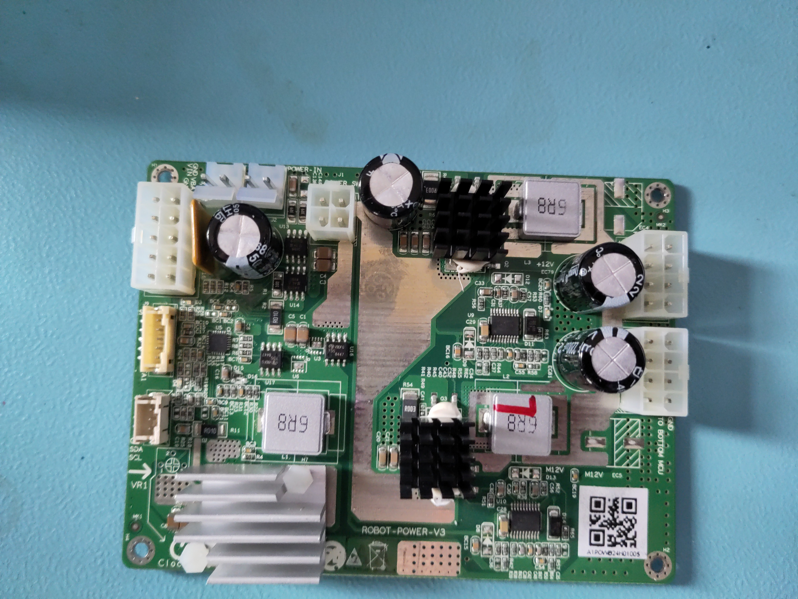

When plugging in my lab-bench power supply to test the power board, I noticed it completely tripped my maximum current (at 2A). 

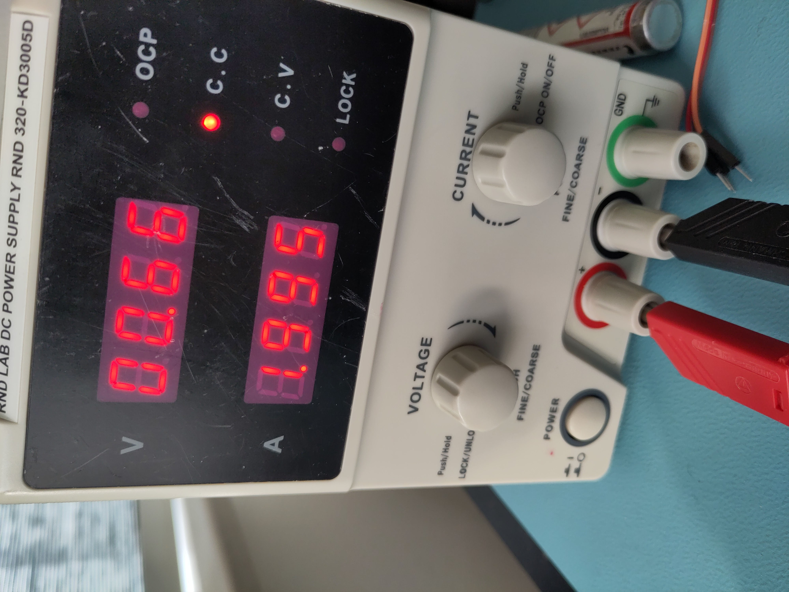

This indicated a fault on the board. Since the charger IC itself was not heating up, the problem likely had to be close to the power input stage. I noticed this reverse-protection diode is letting current flow both ways and generating heat?! 

Measuring the diode in-circuit showed nearly zero resistance in both directions, indicating it had shorted internally. Since this diode sits directly on the input power path, a short effectively placed the supply across ground, explaining the immediate 2A current limit on the bench supply.

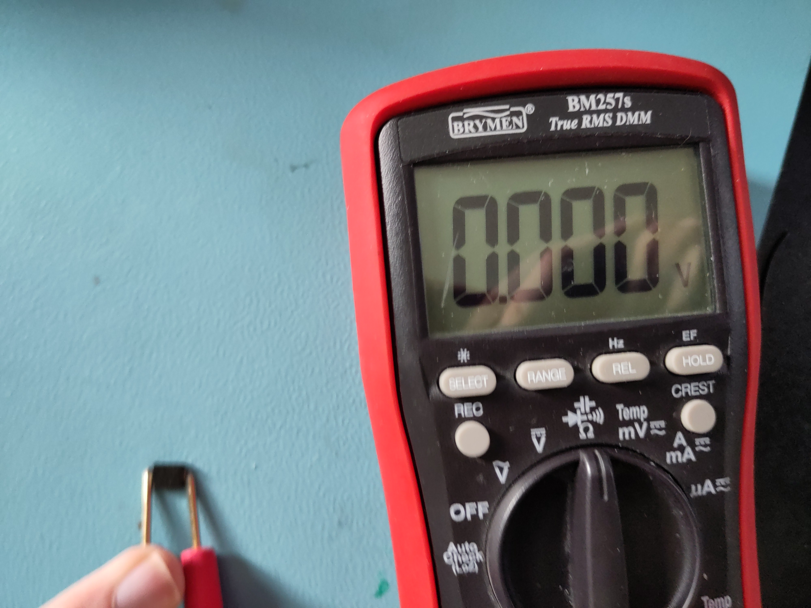

I removed the faulty diode and replaced it with a spare from my parts bin. After reassembly, the board functioned normally again

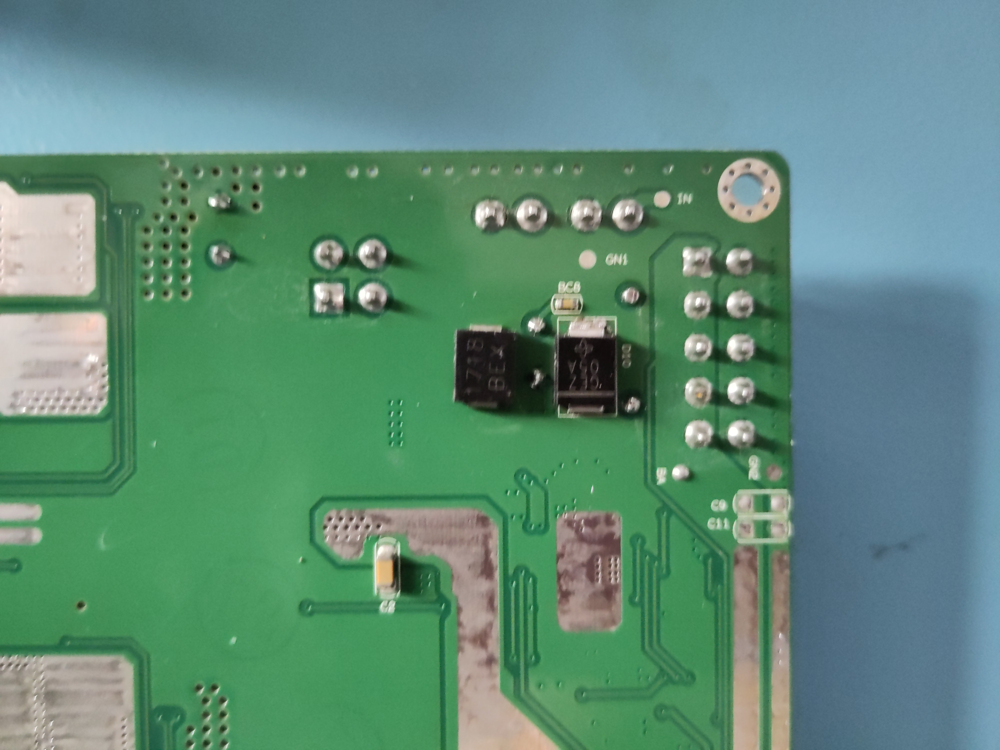

Guess what?! It showed the charge symbol! Mission accomplished.

P.S. The picture of bot charging is old picture, that's why SOC does not match serial monitor output

## Conclusion

Due to a shorted reverse-protection diode on power board the robot wouldn't charge anymore. It was easily repaired with a new 5-cent diode. Although the robot now charges, the battery pack shows significant imbalance (>0.5 V delta), which suggests aging cells. Replacement is recommended for long-term reliability.