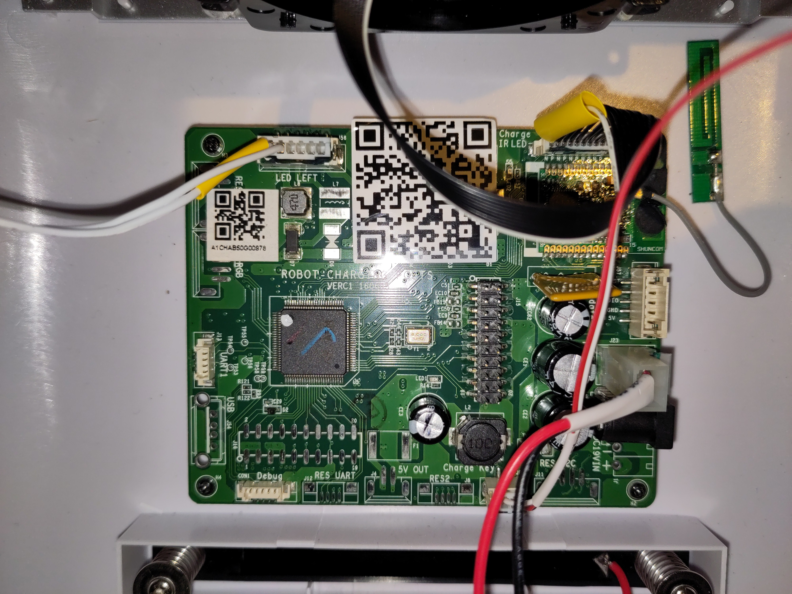
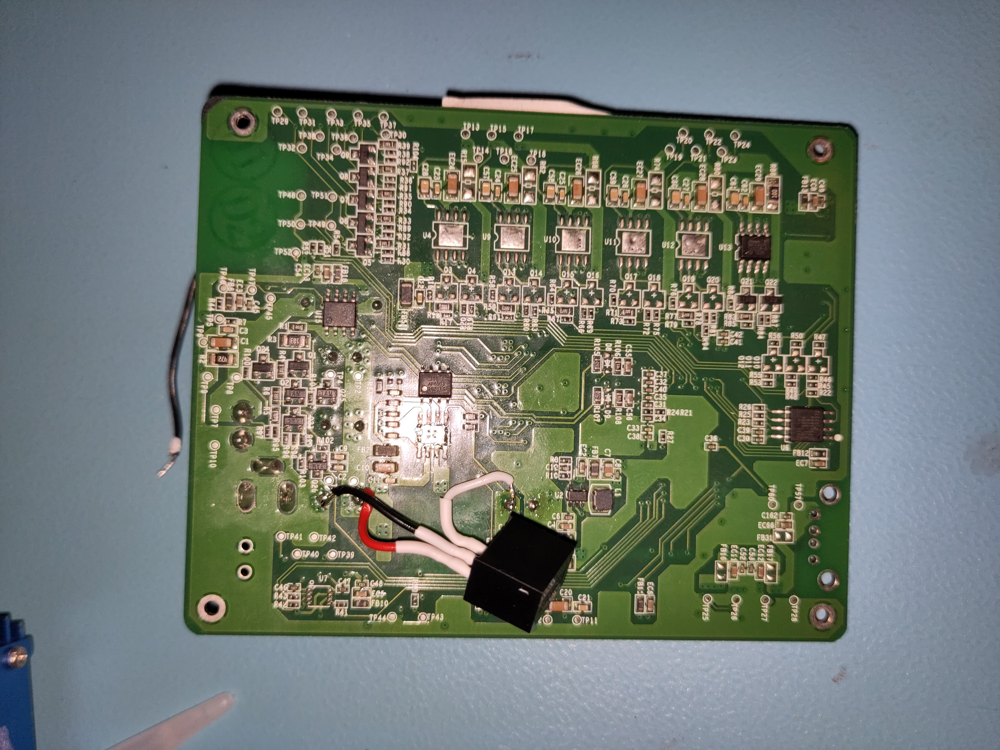

[Previously, we repaired the power supply of the Sanbot Elf itself](00_repairing_sanbot.md). The robot originally came with a charging dock. Unfortunately, I quickly discovered that the dock supplied with the robot had also failed.

For reference this is what the dock looks like:

## Lack of Online-resources

There is almost no technical information available online about this dock beyond basic specifications such as dimensions, input voltage, and status indicators. However, it likely contains Zigbee and infrared functionality. I suspect the large dome on top is used for IR docking detection, while Zigbee may be used to negotiate a successful docking event before enabling the charging output. This would make sense, as the robot is known to generate noticeable inrush current sparks when directly connected to the adapter.

## Disassembly

Disassembly is straightforward: remove the four screws at the back and carefully separate the front and rear housing halves. As usual with Qihan products, locking tabs are used, so gentle wiggling is required.

Inside, there will be a small circuitboard which runs the whole dock.

The next step was to power it from a bench power supply and observe its behavior.

## Issue 1: TVS diode shorting the supply lines

While powering the robot dock from my lab bench power supply, I noticed again that my 2A limit on my bench supply was reached immediately. 

Ofcourse, I went on a search trying to find what was shorting my supply. Once again, the culprit turned out to be a diode, this time a TVS diode across the input lines.

A failed TVS diode was an obvious suspect, as these devices are connected directly across the supply rails to clamp voltage spikes, but when they fail, they often fail short-circuit, effectively placing a direct short across the supply.

To fix it I desoldered the diode, and left it unpopulated for now:

 

Issue fixed right?! Now the device should turn on.... Well nope. Something else is still defective.

## Issue 2: Missing 3.3V line

Like most microcontroller-based systems, the dock operates from a 3.3V logic supply. Since the input voltage is 19V, it must be stepped down to 3.3V using a switching regulator.  

The regulator used on the board is an AP6503 synchronous buck converter from Diodes Inc. Pretty good regulator for the money, though the measurements showed that the regulator was not producing the expected 3.3V output. I removed the faulty AP6503 and replaced it with a RECOM 3.3V buck regulator module, which I had available in my parts stock.

Now the device powers up and connects to the robot.

## Conclusion

A shorted TVS diode across the input and a failed 3.3V regulator prevented the dock from powering up. Removing the failed TVS diode and replacing the regulator restored full functionality to the dock.