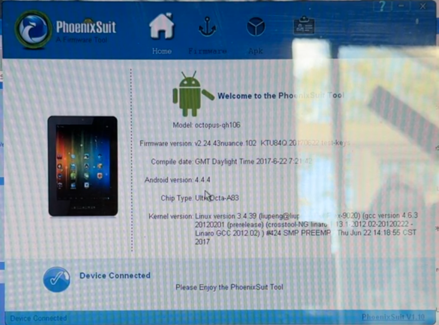
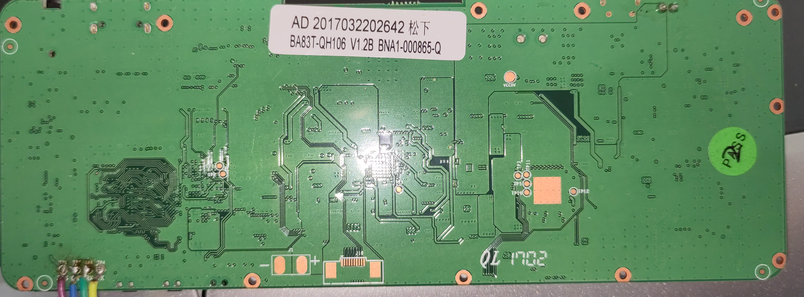

With the Sanbot repaired in blog posts [#1](00_repairing_sanbot.md) and [#2](01_repairing_sanbot_dock.md), it’s time to address the next bottleneck: the aging tablet inside the robot.

The tablet runs Android 6 and, due to its limited CPU performance and RAM capacity, cannot run newer Android versions. Now that this tablet is roughly eight years old (ancient in Android years), it’s time to uncover its deeper workings and possibly replace it with something that doesn’t struggle to open the settings menu.


!!! warning annotate "Legal note"

    This research was conducted on hardware legally owned by the author.
    All analysis is performed for the purposes of interoperability,
    repair, and educational research.

    No proprietary firmware or copyrighted software
    is redistributed on this site.


---

## About the Tablet

The tablet inside the Sanbot effectively runs the entire robot. It is built around an Allwinner A83T SoC on a custom PCB. Through a USB connection, it communicates with and controls the robot’s subsystems head board, main board, MCU, the whole circus.

As shown in this block diagram from [Igor Lirussi’s thesis](https://amslaurea.unibo.it/id/eprint/19120/1/lirussi_igor_tesi.pdf):


Which means: if we want to retrofit or replace this tablet, we either need:

- A full firmware (ROM) dump  
- Or at least the relevant system applications responsible for robot communication  

Preferably the ROM. Because pain is optional.

---

## Plan of Attack

The easiest way to obtain a firmware dump is usually to locate official update packages. Vendors love hosting update files somewhere. Sometimes even publicly. Sometimes accidentally. Sometimes hidden behind 2005-era PHP endpoints.

While searching online, I found this [YouTube video from Simon Burfield](https://www.youtube.com/watch?v=xCGGVcfay2U), showing how to enable Android developer mode and update the software using PhoenixSuit:



PhoenixSuit is an Allwinner flashing tool

This suggests the tablet uses Allwinner’s flashing mechanism rather than standard Android OTA recovery. Meaning: somewhere, at some point, there must exist a firmware image.

I *could* email Sanbot and politely ask for it.

But where’s the fun in that?

---

### Options to Consider

1. **Profile the upgrade app via ADB**
   - Monitor logcat
   - Capture HTTP requests
   - Identify update endpoints
   - Try to replicate requests manually

2. **Enable developer mode and dump installed APKs**
   - Pull system apps via ADB
   - Reverse engineer communication routines
   - USB-sniff traffic between tablet and robot boards  
   (Decompiling is a last resort. We’re civilized.)

3. **Go full hardware mode**
   - Solder a UART adapter
   - Access U-Boot
   - Dump NAND directly
   - If that fails: abuse Allwinner FEL mode and upload custom U-Boot  

Naturally, I chose chaos.

---

## Profiling the Upgrade App

Since a full firmware dump would make life easier, I started with the upgrade app.

Enabling developer mode required connecting the tablet to WiFi. Because apparently you cannot enable developer mode without first saying hello to the mothership.

After graciously sharing my IP address with the manufacturer, I connected via ADB and ran:

```bash
adb logcat | grep -i http
```

Which yielded:

```
https://market.sanbotcloud.com:22281/Interface/file_link2.php?mark=SYS&version=v1.10.41.118&...
https://market.sanbotcloud.com:22281/Interface/update.php?mark=MCU&cond=TOP&...
https://market.sanbotcloud.com:22281/Interface/update.php?mark=MCU&cond=BOTTOM&...
```

Two interesting endpoints appear:

* `file_link2.php` → likely ROM updates
* `update.php` → likely MCU firmware (main & head boards)

Promising.

---

### Manual API Probing

Naturally, I tried poking the API directly:

```bash
curl -k "https://market.sanbotcloud.com:22281/Interface/file_link2.php?mark=SYS&version=v1.10.41.118&..."
```

Response:

```
{"result":"1","fileList":"该版本已是最新版本"}
```

Translation:

> “Already the latest version.”

I tried:

* Fake versions
* Older versions
* Modified parameters

Nothing. No firmware URL. No file list. No jackpot.

The server was not impressed.

---

## Adding UART and Trying to Dump ROM via U-Boot

Time to escalate.

This meant soldering wires to the backside of the tablet PCB.



And I was rewarded with a U-Boot log:

```
U-Boot 2011.09-rc1-00000-g0c9f221-dirty (Jul 08 2017)
Allwinner Technology
```

Promising… until it wasn’t.

Boot continued, kernel loaded, Android started… but no interactive U-Boot prompt. No console. No interruption window.

They locked the UART console in U-Boot.

---

## Fine. We Bring Our Own U-Boot.

If we can’t use theirs, we load ours.

Using Allwinner FEL mode, I compiled a custom U-Boot build and attempted to access the eMMC:

```
=> mmc list
=> mmc dev 2
Card did not respond to voltage select! : -110
```

All attempts resulted in:

```
MMC: no card present
```

Which is impressive, considering Android clearly booted from *something*.

The issue: I didn’t have the original `.bin` configuration or correct DTS settings. Without the proper DRAM and MMC configuration, U-Boot simply refuses to talk to the eMMC.

So I had:

* A working Android system
* A custom U-Boot
* Full control over FEL mode
* Zero storage access

Beautiful.

At this point, brute-force hardware dumping was becoming an exercise in masochism.

So I pivoted.

---

## Reverse Engineering the Apps

If we can’t extract the ROM cleanly, we extract what matters:

The apps that control the robot.

Because somewhere inside those APKs lies:

* The USB protocol
* The command structure
* The robot control logic
* And possibly the key to replacing this ancient tablet entirely

Time to open JADX.

To be continued…

