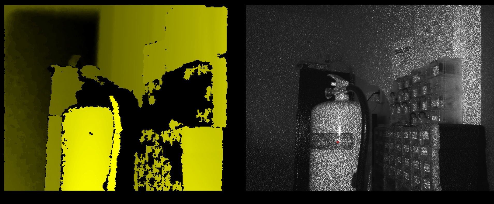

With my quest of [part 1 ending with a dump of the Apps of the android apps running the robot](02_sanbot_quest_dump_rom.md), it was time to find out with the dump and information already available. If we can control this robot with our computer over the USB connection.


!!! warning annotate "Legal note"

    This research was conducted on hardware legally owned by the author.
    All analysis is performed for the purposes of interoperability,
    repair, and educational research.

    No proprietary firmware or copyrighted software
    is redistributed on this site.


## Plugging the robot into my USB port

First thing I had to do is disassemble the robot a bit, because we need to access the USB port of the tablet. Where we can unplug the USB cable going to the MCU Head and body controller as well as the camera's and microphones.

After plugging in the USB cable and running lsusb the following devices appeared:

```bash
$ lsusb
Bus 001 Device 017: ID 2bc5:0401 Orbbec 3D Technology International, Inc Astra
Bus 001 Device 018: ID 05e3:0608 Genesys Logic, Inc. Hub
Bus 001 Device 019: ID 0483:5741 STMicroelectronics XXXXXXXXX-STM32 Virtual COM Port
Bus 001 Device 020: ID 1d6b:0102 Linux Foundation EEM Gadget
Bus 001 Device 021: ID 0483:5740 STMicroelectronics Virtual COM Port
```

Great from this it is already clear that we have two USB CDC-ACM ports (VCOM) for the STM32 microcontrollers, presumably one VCOM for the Head and one for the Body control board. One 3d-camera from orbbec and Linux foundation EEM-gadget, which is the microphone and HD-camera situated in the head.

## Orbbec 3D-Camera 

The orbbec 3D camera matches with the astra orbbec camera driver, [I found for windows on the GitHub of Vidicon Sanbot elf hacking project](https://github.com/Vidicon/sanbot_elf_hacking/blob/main/orbbec_camera/astra-win32-driver-4.3.0.22.zip). And with firing up Windows, as Linux SDK has very old dependencies and wanting to atleast get something working, I was greeted with this screen [using this openni-sdk](https://dl.orbbec3d.com/dist/openni2/v2.3.0.86-beta6/Orbbec_OpenNI_v2.3.0.86-beta6_windows_release.zip). Later on when refitting this robot with new hardware/software, I will probably port the old openni-sdk to new dependencies as far as it is possible.



## HD-Camera and Microphones

