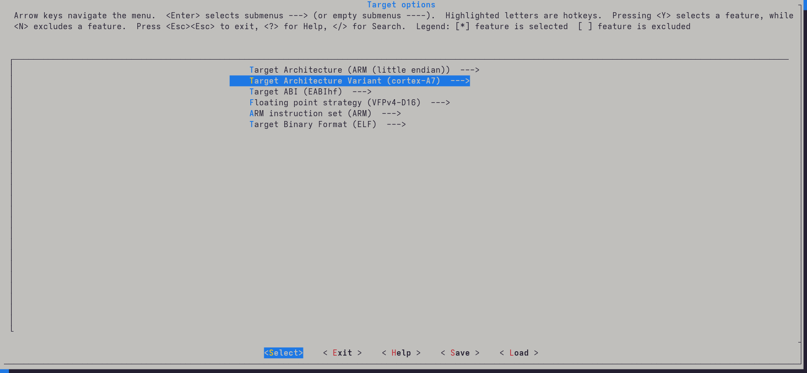
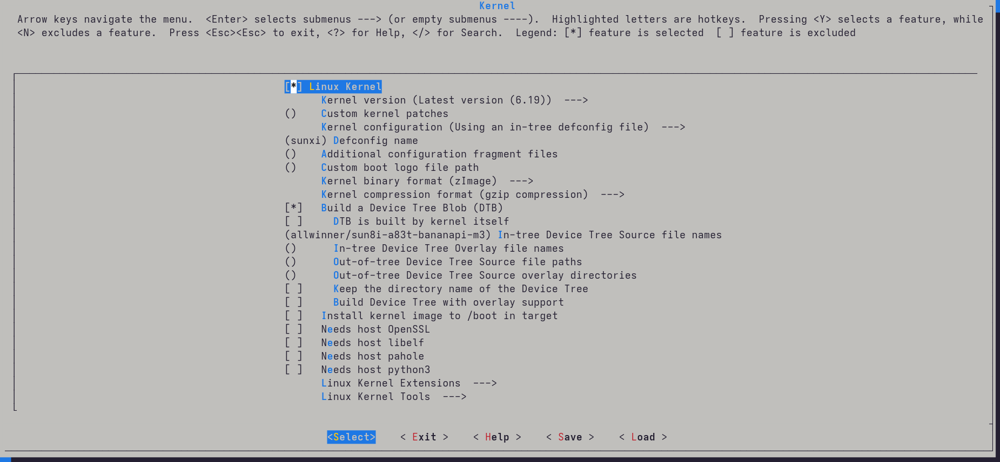
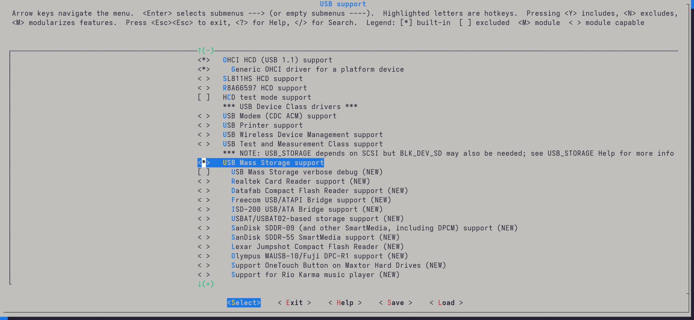

With a working u-boot in [part 4 of this series](05_sanbot_working_uboot.md), what could we possibly add? More of our own code, of course. In this blog post I will describe how I got Buildroot working on this ancient 10-year-old tablet.

!!! warning annotate "Legal note"

    This research was conducted on hardware legally owned by the author.
    All analysis is performed for the purposes of interoperability,
    repair, and educational research.

    No proprietary firmware or copyrighted software
    is redistributed on this site.

## Why Buildroot?

For those who don't know, Buildroot is a very easy way to hack together a small Linux distro. It consists mostly of a build system, a mainline (or custom) Linux kernel, and a few useful CLI tools. The build process is straightforward: generate the `.config` with `make menuconfig` and then run `make`. That's it.

So why not Yocto, Armbian, or `<insert any other project here>`?

Because Buildroot is simply easier to modify and rebuild for quick experiments. I only have to tweak the devicetree or adjust options in `menuconfig` to add or remove functionality.

The build also produces nice standalone artifacts like `.dtb`, `zImage`, and `rootfs.tar`, which I can easily copy to a USB drive and boot with my custom U-Boot build.

Yocto would require meta-layers and much more configuration. Armbian also involves a lot more setup. Android builds are huge, and I simply don't need the entire Android userspace for quick testing.

## How I did it

It turns out that mainline Linux already has support for the Banana Pi M3:

[`arch/arm/boot/dts/allwinner/sun8i-a83t-bananapi-m3.dts`](https://github.com/torvalds/linux/blob/master/arch/arm/boot/dts/allwinner/sun8i-a83t-bananapi-m3.dts)

```dts
/ {
	model = "Banana Pi BPI-M3";
	compatible = "sinovoip,bpi-m3", "allwinner,sun8i-a83t";
    ...
}
```

Since the Sanbot tablet also uses the **Allwinner A83T**, this is a good starting point.

So let's clone Buildroot and open the configuration menu:

```bash
git clone https://github.com/buildroot/buildroot.git
cd buildroot && make menuconfig
```

First configure the **Target options**.

Change the following:

* Target Architecture → ARM (little endian)
* Target Architecture Variant → cortex-A7



Next go to **Kernel** and enable the Linux kernel with the following settings:

* Defconfig name → `sunxi`
* Build a Device Tree Blob

  * In-tree Device Tree Source file names: `allwinner/sun8i-a83t-bananapi-m3`



After this, grab some coffee — the compilation takes around **10–15 minutes**.

## Preparing the USB disk

Once the build finishes, prepare a USB drive:

```bash
sudo mkfs.ext4 /dev/<replace_with_usb_part>
<mount the USB using file manager and copy the usb-drive path>
cp -r output/images/zImage <usb_drive_path>
cp -r output/images/sun8i-a83t-bananapi-m3.dtb <usb_drive_path>
sudo tar xf output/images/rootfs.tar -C <usb_drive_path>
```

## Booting it

Next I tried to boot it using my custom U-Boot:

```u-boot
sunxi-fel uboot u-boot-sunxi-with-spl.bin
<press any key in uart-console>

usb start
ext4load usb 0:1 0x42000000 /zImage
ext4load usb 0:1 0x43000000 /sun8i-a83t-bananapi-m3.dtb
setenv bootargs console=ttyS0,115200 earlycon root=/dev/sda1 rw rootwait
bootz 0x42000000 - 0x43000000
```

And it almost booted immediately:

```
=> ext4load usb 0:1 0x42000000 /zImage
5775616 bytes read in 144 ms (38.2 MiB/s)
=> ext4load usb 0:1 0x43000000 /sun8i-a83t-bananapi-m3.dtb
25459 bytes read in 5 ms (4.9 MiB/s)
=> setenv bootargs console=ttyS0,115200 earlycon root=/dev/sda1 rw rootwait loglevel=8
=> bootz 0x42000000 - 0x43000000
Kernel image @ 0x42000000 [ 0x000000 - 0x582100 ]
...
Starting kernel ...
```

Boot logs started scrolling by, but something strange happened:

```
usb 1-1.4.2: USB disconnect
usb 1-1.4.2: new high-speed USB device
usb 1-1.4.2: USB disconnect
usb 1-1.4.2: new high-speed USB device
...
```

Why does my USB device keep connecting and disconnecting?

After digging through `menuconfig`, the answer appeared quickly: **USB mass storage support wasn't enabled.**

Fixing that was easy.

Run:

```bash
make linux-menuconfig
```

Navigate to:

```
Device Drivers
 → USB Support
   → USB Mass Storage support
```

Press **space twice** so the option becomes `*` instead of `M`.



Rebuild the kernel and try again.

And this time:

```
Starting syslogd: OK
Starting klogd: OK
Running sysctl: OK
Starting network: OK
Starting crond: OK

Welcome to Buildroot
buildroot login:
```

It works!

## What's working?

From the limited testing I've done so far:

* CPU and scheduler work fine
* HDMI hotplug detection works
* DRM video output works

This matches the status shown in the [mainline effort table](https://linux-sunxi.org/Linux_mainlining_effort) pretty well.

The **GPU will probably never work on mainline**, unfortunately. The SoC uses an **Imagination PowerVR SGX544MP1**, which only has an old proprietary DDK targeting **kernel 3.4**:

[https://github.com/BPI-SINOVOIP/BPI-M3-bsp/tree/master/linux-sunxi/modules/gpu/sgx544/android/kernel_mode/eurasia_km](https://github.com/BPI-SINOVOIP/BPI-M3-bsp/tree/master/linux-sunxi/modules/gpu/sgx544/android/kernel_mode/eurasia_km)

Newer kernels aren't supported at all, and it doesn't look like there is any intention to mainline it.

In the end, for our custom **Ubuntu Touch** build we will probably have to run an older kernel. Ideally I would like to port the driver to at least **kernel 4.x**, so we can benefit from some of the newer security and stability improvements.

For now though, the next goal is simpler: **getting the display working**.

According to the mainline effort table, the **RGB display interface is supported**, so it should be possible to extract the parameters from the Android ROM and use them to construct a working device tree for the panel.
